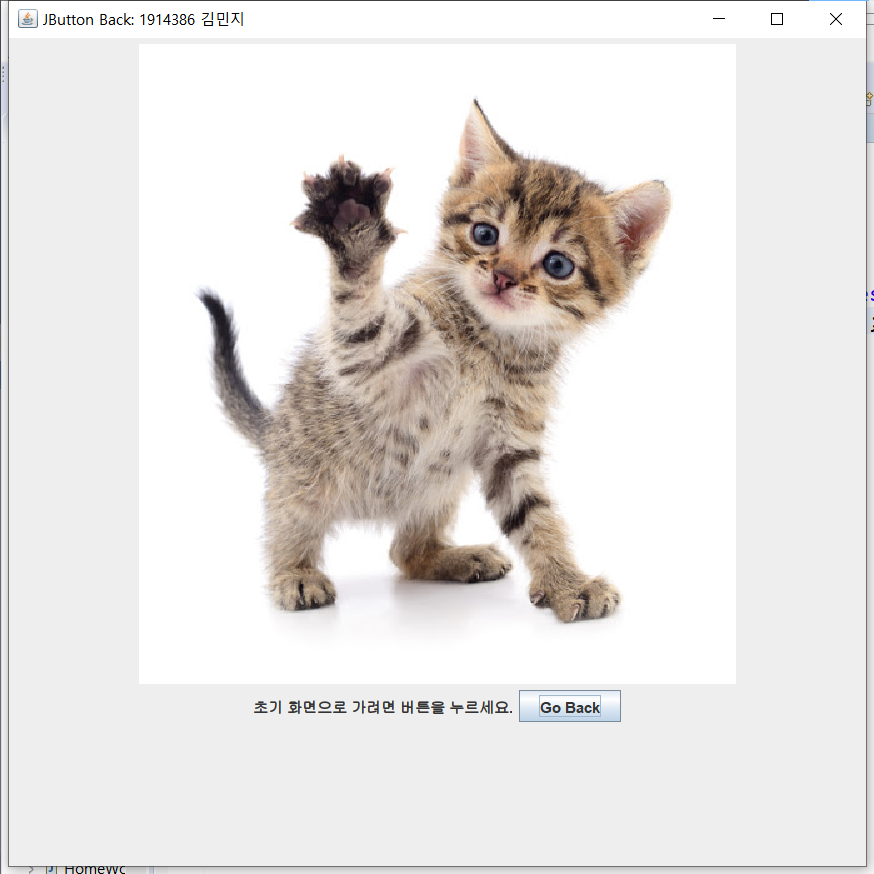
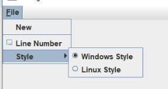

# Chapter 5

### 5.1 Java Swing

* 더 편리한 GUI 컴포넌트를 제공
* Java AWT GUI Components를 상속
* javax.swing.Package에서 제공
* java -jar SwingSet2.jar로 SwingSet 데모 프로그램 실행

### 5.2 Swing Components Hierarchy

* Java.lang.Object
* Java.awt.Component
* Java.awt.Container : 다른 Swing 컴포넌트를 포함할 수 있음
* Javax.swing.Jcomponent
* All Swing components

계층 구조 (Swing에서 추가된 기능)

>)

### 5.3 Swing Components

* [JComponent 클래스](https://docs.oracle.com/javase/7/docs/api/javax/swing/JComponent.html)를 상속받음
  * 모든 Swing GUI 컴포넌트들의 최상위 컴포넌트 클래스
  * 모든 Swing 컴포넌트들에서 자주 사용되는 메소드와 특징을 포함
  * paint(Graphics g): 캔버스에 그래픽 소스를 만들어 올릴때 사용
  * repaint(): 재출력

**1) JFrame**

* 컨테이너 개념, AWT의 Frame과 같은 기능
* getContentPane() 메소드로 다른 컴포넌트를 묶음
* 생성자: JFrame(String title, GraphicsConfiguration gc) // 괄호 안의 내용은 선택
* 주요 메소드:
  * getContentPane() <= add()
  * setContentPane()
  * SetJMenuBar(JMenuBar menubar)
  * SetLayout()
  * setDefaultCloseOperation(프레임.EXIT\_ON\_CLOSE) // 윈도우창 종료 시 프로세스까지 종료

**2) JLabel**

* 이미지(아이콘)과 함께 텍스트 출력
* 생성자: JLabel(String text, Icon image, int alignment) // 텍스트, 이미지, 정렬(LEFT, RIGHT, CENTER, TOP, BOTTOM)
* 주요 메소드:
  * getText(), setText(), getIcon(), setIcon()
  * setHorizontalAlignment() ← LEFT, RIGHT, CENTER // 가로
  * setVerticalAlignment() ← TOP, BOTTOM, CENTER // 세로

**3) JPanel**

* AWT의 Panel과 동일
* 생성자: JPanel(LayoutManager layout)

**4) AbstractButton**

* 클릭과 선택 기능에 관한 common method를 정의
* JButton, JCheckBox, JRadioButton, JToggleButton, JMenu, JMenuItem 상속
* 주요 메소드: getIcon(), setIcon(), getText(), setText(), setHorizontalAlignment(),
* setVerticalAlignment(), getHorizontalAlignment(), getVerticalAlignment()
* **JButton**
  * 마우스 클릭에 의해 액션이 동작하며, AWT의 Button과 유사
  * AWT와의 차이: 이미지 아이콘을 추가할 수 있음
  * 생성자: JButton(String name, Image icon) // 이름, 이미지\<JButton : Lab1>

**\<JButton에 Back 기능 구현>**

>)

>)

구현 화면

 (버튼을 눌렀을 때)

>) (버튼을 한 번 더 눌렀을 때)

* **JCheckBox, JRadioButton, JToggleButton**
  * AWT의 Checkbox, CheckboxGroup(=RadioButton)과 유사
  * 생성자:
    * JCheckbox(String, Boolean)
    * JRadioButton(Icon, String, CheckboxGroup, Boolean)
    * JToggleButton()
  * 주요 메소드: addItemListener()

**5) JList**

**6) JComboBox**

**7) JTextComponent**

**8) JTabbedPane**

.png>)

**9) JTable**

**10) JTree**

&#x20;**** ****

**11) JInternalFrame**

.png>)

**12) JMenu**

********

**13) JDialog**

****.png>)****

****
