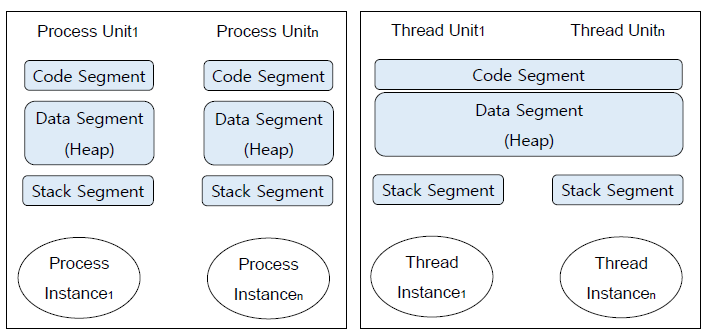
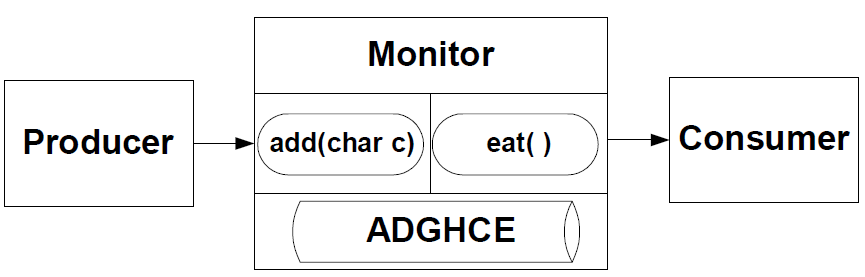

# Chapter 8

### 8.0 프로그램 실행 유닛

>)

프로그램

* 일련의 소프트웨어 관리 단위
* 실행할 명령어의 순서
* 다양한 프로세스로 구성됨
* 하나의 프로그램 자체가 하나의 실행 유닛이 될 수 있음 (기본)

Single Processing

프로세스(Process)

* 동작하고 있는 프로그램
* 각각의 독립된 메모리 영역(Code, Data, Stack, Heap)을 할당받음
* Java(OOP)에서는 Class Object가 하나의 실행 유닛
* 여러 개의 실행 유닛이 모여 하나의 프로그램이 될 수 있음

Multi-Processing

실행 유닛(Execution Unit)

* \== 메인 메모리에 만들어지는 인스턴스(실체)
* 인스턴스가 만들어지고 메인 메모리에 공간을 확보해야 프로그램이 돌아간다.

스레드(Thread)

* 하나의 프로세스 내에서 독립적으로 실행되는 하나의 작업 단위
* 프로세스 내에서 Stack만 따로 할당받고 Code, Data, Heap 영역을 공유함

**Execution Unit in Java Application**

>)

* 멀티 프로세싱: 하나의 응용 프로그램을 여러 개의 프로세스로 구성하고 각 프로세스가 하나의 작업을 처리
* 멀티 스레드: 하나의 응용 프로그램을 여러 개의 스레드로 구성하고 각 스레드가 하나의 작업을 처리

>)

프로그램(Java Application) > 프로세스(Class Object Instance) > 스레드(Class Object Instance)

**Concurrent Processing Concept (병렬/동시 처리)**

* 동기화(Synchronization)
  * 프로세스 간 Queue 지연
  * 여러 프로세스 간 실행 순서를 지원하는 함수
  * 예) Binary semaphore’s Lock/Unlock
* 상호 배제(Mutual Exclusive)
  * 동시에 실행할 수 없는 로직
  * 예) Read/Write, Input/Output
* 프로세스 간 통신(Communication)
  * 예) Mailbox (Message Queue), Socket

**Thread가 필요한 이유**

* Process Unit의 문제점
  * 프로세스 인스턴스 생성 과정에서 오버헤드 발생
  * 프로세스 간 문맥 변경 과정에서 캐시 메모리 초기화 등 무거운 작업이 진행되고 많은 시간이 소모되는 등 오버헤드 발생
    * 문맥 변경(Context Switching): CPU에서 여러 프로세스를 돌아가면서 작업을 처리하는 과정. CPU가 한 개의 Task(Process / Thread) 를 실행하고 있는 상태에서 Interrupt 요청에 의해 다른 Task로 실행이 전환되는 과정에서 기존의 Task 상태 및 레지스터 값들에 대한 정보(Context)를 저장하고 새로운 Task의 Context 정보로 교체하는 작업
    * 프로세스는 각각의 독립된 메모리 영역을 할당받기 때문에, 프로세스 간의 Context Switching 시 단순히 CPU 레지스터 교체 뿐만 아니라 RAM과 CPU 사이의 캐시 메모리에 대한 데이터까지 초기화되므로 오버헤드가 큼\[1]
  * 다중 프로세스 컨트롤에서의 오버헤드 발생
* Thread Unit의 장점

>)

*
  * 시스템 자원 소모 감소: 프로세스를 생성하여 지원을 할당하는 시스템 콜 감소
  * 스레드 사이의 작업량이 작아 Context Switching이 빠름
  * 프로세스 내의 Stack 영역을 제외한 모든 메모리를 공유 스레드 간 데이터 주고받는 것이 간단하며 통신 부담 적음

**Thread의 구조**

* 프로세스: 각각의 독립된 메모리 영역(Code, Data, Stack, Heap)을 할당받음
* 스레드: 프로세스 내에서 Stack만 따로 할당받고 Code, Data, Heap 영역을 공유함 문맥 변경 빠름

**Processing Structure of Thread**

* 하나의 클래스 인스턴스 내에서 여러 개의 스레드 인스턴스 존재
* Scheduling Unit: 클래스 인스턴스 내 스레드 클래스 인스턴스
* CPU가 스레드 간 실행 순서 결정

### 8.1 Java Thread

1. Thread 클래스 _run() 고정됨_ (고정된 용도를 반복할 때 유용)
2. Runnable 인터페이스 _run() 재구현함_ (다양한 용도가 있을 때 유용)

* java.lang.Thread 패키지 사용
* Thread 생성자: Thread(Runnable, String)

**Java Thread의 메소드**

* void run(): 실행
* void start(): 실행
* sleep(): 잠깐동안 멈춤
* suspend(): 일시정지
* resume(): 다시 시작

**Java Thread 인스턴스의 생명주기**

>)

* Runnable: 스레드가 실행되기 위한 준비 단계
  * start() 메소드를 호출하면 run() 메소드에 설정된 스레드가 runnable 상태에 진입
* Running: 스케줄러에 의해 선택된 스레드가 실행되는 단계
  * Runnable 상태 중 우선순위를 가진 스레드가 결정되면 JVM이 자동으로 run 메소드 호출
* Blocked: 스레드가 작업을 완수하지 못하고 잠시 작업을 멈추는 단계
* Dead: 스레드가 모두 실행된 종료 단계

### 8.2 Java Thread Using Methods

1. Thread 클래스
   * Thread 클래스로부터 상속받는 스레드 정의: class MyThread extends Thread
     1. public void **run()** { }: 스레드가 실행되는 내용
        * 상위 클래스인 Thread 클래스의 run() 메소드를 오버라이딩
        * 스레드가 수행해야 하는 문장 기술
     2. MyThread me = new MyThread(): 스레드 오브젝트 인스턴스 생성
     3. me.**start()**: 스레드 오브젝트 시작
2. Runnable 인터페이스
   * Runnable 인터페이스로부터 상속받는 스레드 정의: MyRunnable implements Runnable { }
     1. public void **run()** { }: 스레드가 실행되는 내용
        * Runnable 인터페이스에 정의된 run() 메소드를 오버라이딩
        * 스레드가 수행해야 하는 문장 기술
     2. MyRunnable ro = new MyRunnable(): 스레드 오브젝트 생성
     3. Thread rt = new Thread(ro): ro를 매개변수로 하는 스레드 오브젝트 생성
     4. rt.start(): 스레드 오브젝트 시작

### 8.3 Java Thread Stop

스레드 종료 방법

1. run() 메소드가 끝나면 자동 종료 (자체 종료)
2. 무한 반복에서 스레드 종료하기 (타 스레드의 도움)
   1. 반복문의 조건문 이용 while(stop == false) { … }
   2. 반복문 내의 if 조건문 이용 while(true) { if(Thread.isInterrupted) break; }
3. InterruptException 사용: 수행 중 Interrupt 발생 시킴, 자체적으로도 가능
   1. Timer 기능을 통해 InterruptException 유발 : thread.interrupt();
   2. 후에 isInterrupted() 또는 interrupted()로 확인 및 종료
4. ~~Stop()~~은 권장 안 함

### 8.4 Java Thread’s concurrency(동시성)

* suspend(), resume()

>)

**8.5 Java Thread’s Mutual Exclusion(상호 배제)**

* 병렬 처리를 위한 모니터 개념 Java에서의 ‘동기화’ 키워드
* Monitor.java: 동기화된 모니터 개념
* Producer.java
* Consumer.java
