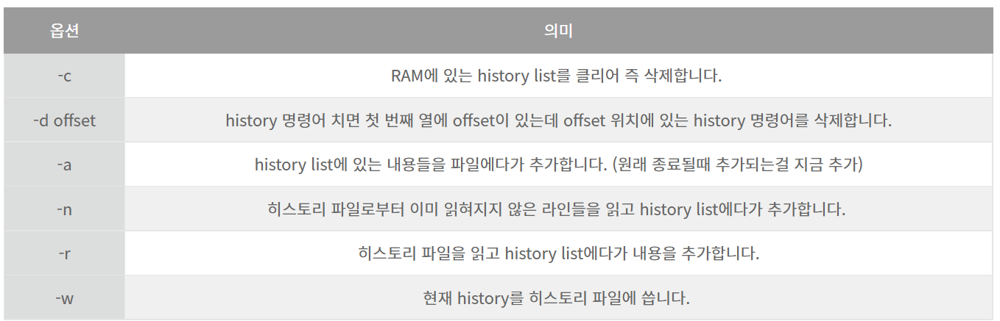

# Chapter 4

## 자주 쓰는 명령어&#x20;

```bash
명령어 —help
man 명령어

cd: 디렉터리 이동 (cd .. : 상위 디렉터리 이동) 
pwd: 현재 디렉터리 출력 
ls: 파일 목록 
cp: 파일을 현재 디럭터리에 복사 
Shift + Enter: 언어 변경 
Ctrl + Alt: 마우스 빠져나옴
```


**시스템 종료**

* `poweroff`
* `shutdown -P (또는 h) 시간` : 일정 시간 뒤 종료
  * now: 지금
  * \+10: 10분 뒤
* `halt -p`
* `init 0`
* `shutdown -c` : 셧다운 취소

**재부팅**

* `shutdown -r` 시간: 재부팅
  * 시간 예시: now, 22:00
* `reboot`
* `init 6`
* `shutdown -k +15` : 15분 후 종료된다는 메시지 보냄(실제로 종료 x)

**로그아웃**

* `logout`
* `exit`

**가상 콘솔 이동**: `Ctrl + Alt + F1~F6`

**런레벨**

* init 0: 종료
* init 1: 시스템 복구 모드, 단일 사용자 모드 (Rescue)
* init 3: 텍스트 모드의 다중 사용자 모드 (Multi-User)
* init 5: 그래픽 모드의 다중 사용자 모드 (Graphical)
* init 6: 재부팅(Reboot)

\*2,4번은 사용 안 함

* 런레벨 모드 확인

```bash
ls-l /etc/systemd/systemd/default.target
```

* 런레벨 모드 변경

```bash
ln -sf /lib/systemd/system/multi-user.target /etc/systemd/system/default.target
```

X 윈도 실행: `startx`

그동안 입력한 명령어 모음: [history](https://jhnyang.tistory.com/306)

* n번 명령어 실행: `!n`
* 명령어 히스토리 삭제: `history -c` (clear)
* `!string`: string으로 시작하는 가장 최근에 실행한 명령어를 찾아 실행
  * `!string:p` : 실행하지 않고 명령어만 출력
* `!!` : 직전 명령어 실행



`cat 파일명`: 파일 내용 출력

`gedit 파일명`: 파일 편집

`vi 파일명`: vi 에디터로 파일 편집 (새로운 파일명 입력하면 생성)

.png>)


* 명령모드에서 문자열 찾기
  * `/문자열`: 현재 커서 이후 해당 문자열 찾음
  * `?문자열`: 현재 커서 위로 해당 문자열 찾음(역방향)
  * `n`: 찾은 문자 중에서 다음 문자로 이동
* ex(라인 명령) 모드에서 문자열 치환: `:%s/기존문자열/새문자열`
* vi 에디터 앞에 행 번호 표시: `:set number`
* 특정 줄 찾기: `:줄번호`
* 단어 전체 지우기: `cw`


**마운트**: 하드디스크 파티션, CD/DVD, USB 등 물리적인 장치를 특정한 위치, 폴더에 연결하는 과정

* CD/DVD 장치: /dev/cdrom = /dev/sr0
  * CD/DVD 디렉터리: /run/media/
* USB 메모리 장치: /dev/sdb1
* 현재 마운트된 장치 확인: `mount`
* 마운트 해제: `umount /dev/cdrom`


### 리눅스 기본 명령어

[https://jhnyang.tistory.com/13](https://jhnyang.tistory.com/13)

[https://jhnyang.tistory.com/14?category=815412](https://jhnyang.tistory.com/14?category=815412)

**ls**: 현재 디렉터리 파일 목록

* \+ 디렉터리명: 해당 디렉터리 목록
* `-a`: 숨김 파일 포함
* `-l`: 자세히
* `-d`: 디렉터리에 대한 정보
* `*.cfg`: 확장자가 cfg인 목록
* `d*` : d로 시작하는 목록

**cd**: Change Directory(디렉터리 이동)

* 기본값 또는 `~`: 홈 디렉터리
  * 사용자의 홈 디렉터리
    * /home/사용자명
    * \~사용자명
  * root의 홈 디렉터리: /root
* `~username`: username 사용자의 홈 디렉터리 이동
* `..`: 상위 디렉터리 이동
* `/etc/sysconfig`: 절대 경로
* `../etc/sysconfig`: 상대 경로 (상위 디렉터리로 이동한 후 이동)

**pwd**: 현재 디렉터리의 경로

**rm**: ReMove(삭제)

* `-i`: 삭제 확인 메시지 출력
* `-f`: force, 바로 삭제
* `-r`: recursive, 해당 디렉터리 삭제
  * `-rf`: 해당 디렉터리 및 하위 디렉터리까지 모두 삭제 (주의)
  * `-r *`: 현재 디렉터리에 있는 파일/디렉터리 모두 삭제

**cp**: CoPy, 복사 (명령 실행하는 사용자는 해당 파일의 읽기 권한이 필요)

* `파일명 바꿀파일명`: 이름 바꿔서 파일 복사
* `-r abc cba`: 디렉터리 복사
* `../lib/abc .`: 현위치의 상위 디렉터리 아래에 있는 lib 디렉터리의 abc 파일을 현재 디렉터리(`.`) 에 복사

**touch 파일명**

* 크기 0인 새 파일 생성
* 존재하는 파일 최종 수정 시간을 현재 시간으로 변경

**mv**: MoVe, 옮김

* `abc.txt /etc/sysconfig`: abc.txt를 /etc/sysconfig로 이동
* `aa bb cc dd`: aa, bb, cc 파일을 dd 디렉터리로 이동
* `abc.txt new.txt 경로`: 이름 바꿔서 이동
* `mv 파일명 ../`: 상위 디렉터리로 이동

**mkdir**: 새로운 디렉터리 생성

* `디렉터리명`: 현재 디렉터리 아래에 생성
* `-p /def/fgh`: 부모 디렉터리 없으면 자동 생성

**rmdir**: 디렉터리 삭제(삭제 권한 필요하며 비어있어야 함)

**cat**: 파일 내용 출력

**head/tail**: 앞/뒤 10행 출력

* `-3`: 앞/뒤 3행

**more**: 페이지 단위 출력(스페이스 바로 이동, B 앞페이지, Q 종료) >> **less** (기능 확장)

* `+100`: 100행부터 출력
* `cat 파일명 | more`

**file**: 파일 종류

**clear**: 터미널 화면 지움

### 사용자와 그룹

`id`: 로그인 정보

`ls -al /home`: 사용자 확인

* 사용자: /etc/passwd
  * 사용자명 : 암호 : 사용자ID : 그룹ID : 전체 이름 : 홈 디렉터리 : 기본 셸
* 패스워드: /etc/shadow
* 그룹: /etc/group
  * 그룹명 : 비밀번호 : 그룹ID : 그룹에 속한 사용자명

**186\~188p 명령어**

useradd: 사용자 추가 (root 사용자만 가능)

* `-u`: 사용자 아이디 지정
* `-g`: 그룹
* `-d`: 디렉터리 지정
* `-s`: 기본 셸 지정

passwd: 사용자 비밀번호 지정/변경

usermod: 사용자 속성 변경

userdel: 사용자 삭제

chage: 암호 주기적 변경

groups: 소속 그룹

groupadd: 새 그룹 생성

groupmod: 그룹 속성 변경

groupdel: 그룹 삭제

gpasswd: 그룹 암호 설정, 그룹 관리

### 소유권, 허가권

파일유형 \[rw-r—r—] 가리키는링크수 소유자 소유그룹 파일크기 최종수정일시 파일명

* 파일 유형
  * b: 블록 디바이스 (HDD 등)
  * c: 문자 디바이스 (마우스, 키보드, 프린터 등)
  * l: 링크
* 파일 허가권
  * **r(읽기), w(쓰기), x(진입)**
  * **u(소유자), g(그룹), o(그 외 사용자)** 권한 순
  * 6 → 2진수 110 → rw- → 9진수 420
* **chmod**: 파일 허가권 변경
  * chmod 777 sample.txt: 777로 변경
  * chmod u+x 파일명: 소유자(u)에게 실행권한(x) 허가(+)
  * chmod g-rx: 그룹(g)에게 읽기,실행 권한(rx) 제거(-)
  * a: 모든 사람(소유자/그룹/그 외)
* **chown**: 파일 소유권 변경 (195p)
* **chgrp**: 소유한 그룹 변경

[linux, ls 결과의 + (plus) 기호, ACL](http://www.debugme.co.kr/2017/11/linux-ls-plus-acl.html)

해당 파일이 ACL (Access Control Lists) 를 사용하고 있다는 뜻!

**setuid bit**: root 소유, 실행하는 순간 root의 권한을 잠깐 빌려와서 실행

* 8진수는 사실 네 자리인데(앞에 0 생략되어 있음), 첫 번째 값을 100(=4)로 표현
* x → s
* 설정하는 법: `chmod u+s 파일명`

**setgid bit**: 사용자가 아닌 그룹에 대해서 적용

* 8진수 첫 번째 값 = 010(=2)
* x → s

**stiky bit**: 모든 사용자가 파일/디렉터리 생성하여 사용 가능, 다른 사용자 파일은 삭제 불가

* 8진수 첫 번째 값 = 001(=1)
* x → t
* `chmod o+t 파일명`

"SetUID"를 파일에 설정하면 "소유자(u)의 실행권한"에 **x 대신 "s"가 들어가고**

"SetGID"를 파일에 설정하면 "그룹(g)의 실행권한"에 **x 대신 "s"가 들어가고**

"StickyBit"를 파일에 설정하면 "other(o)의 실행권한"에 **x 대신 "t"가 들어갑니다.**

### 링크

* 하드 링크: 원본 파일 (inode1)
  * `ln 링크대상파일명 링크파일명`
* 심볼릭 링크: 바로가기, 원본 파일 포인트로 연결 (inode2)
  * `ln -s 링크대상파일명 링크파일명`

**inode**: 파일 시스템에서 사용하는 자료구조 (소유권, 허가권, 파일 종류, 주소)

* `ls -il`: inode 번호 앞에 출력

### RPM

설치 파일 확장명: \*.rpm → 패키지라고 부름

의존성 문제 → dnf 사용

파일 형식: 패키지명-버전-릴리스번호.CentOS버전.아키텍처.rpm

* CentOS 버전: el8
* 아키텍처: x86\_64(인텔/AMD 계열 64bit CPU)

설치: `rpm -Uvh 패키지파일명.rpm`

* `-U`: 없으면 새로 설치, 있으면 업그레이드
* `-v`: 설치 과정 확인
* `-h`: 설치 진행 과정을 # 기호로 출력

삭제: `rpm -e 패키지이름`

설치된 패키지 조회

* `-qa` 패키지명: 설치 여부
* `-qf` 파일의절대경로: 설치된 파일이 어느 패키지에 포함된 것인지
* `-ql` 패키지명: 특정 패키지에 어떤 파일이 포함되었는지
* `-qi` 패키지명: 상세 정보

설치 안 된 패키지 조회

* `-qlp`: 패키지 파일에 어떤 파일들이 포함되었는지
* `-qip`: 상세 정보


### DNF

설치: `dnf -y install 패키지명`

* `-y`: 무조건 yes
* install 대신 `groupinstall`: 패키지 그룹 설치
* `dnf grouplist`: 패키지 그룹 종류
* `dnf install -nogpgcheck 패키지명`: gpg 키 검사 생략

업데이트 가능한 목록: dnf clean all(기존 저장소 목록 지우기) → `dnf check-update`

업데이트: `dnf update 패키지명`

삭제: `dnf delete 패키지명`

정보 확인: `dnf info 패키지명`

패키지 리스트 확인: `dnf list 패키지명`

* dnf list httpd\*: httpd 이름 들어간 패키지 목록
* dnf list available: 설치 가능한 목록

특정 파일이 속한 패키지 이름 확인: `dnf provides 파일명`

명령어 관련 설정 파일: /etc/yum.repos.d/ 내부 파일들

* 각 명령을 실행했을 때 인터넷에서 패키지 파일을 검색하는 네트워크 주소가 들어있음

### 파일 압축: xz/bzip2/gzip/zip

**xz**

* `xz 파일명.확장자`: 기존 파일 삭제하고 파일명.xz로 압축
* `xz -k 파일명.확장자`: 압축 후 기존 파일 보존
* `xz -d 파일이름.xz`: 압축 해제
* `xz -l 파일이름.xz`: 압축파일 목록, 압축률

**bzip2, gzip, zip**

* `bzip2 파일이름`: 파일이름.bz2로 압축
* `bzip2 -d 파일이름.bz2`: 압축 해제 = `bunzip2 파일이름.bz2`
* `gzip 파일이름`: 파일이름.gz로 압축
* `gzip -d 파일이름.gz`: 압축 해제 = `gunzip 파일이름.gz`
* `zip 생성할파일이름.zip 압축할파일이름`: 윈도우와 호환되는 zip으로 압축
* `unzip 압축할파일이름.zip`: 압축 해제

**compress 확장자: .Z**

### 파일 묶기: tar

**tar**

* 동작
  * `c`: create, 새로운 묶음 생성
  * `x`: 묶인 파일 풀기
  * `t`: track, 묶음 풀기 전 묶인 경로 보여줌
  * `C`: 정해진 디렉터리에 묶음 풀기
* 옵션
  * `f`(필수): file name, 묶음파일 이름 지정
  * `v`: visual, 파일이 묶이거나 풀리는 과정 보여줌
  * `J`: tar+xz
  * `z`: tar+gzip
  * `j`: tar+bzip2
* 사용 예시
  * tar `cf` my.tar 경로/파일명: my.tar 이름으로 묶음
  * tar `cfJ` my.tar.**xz** 경로: 묶고 xz 압축
  * tar `cfz` my.tar.**gz** 경로: 묶고 gzip 압축
  * tar `cfj` my.tar.**bz2** 경로: 묶고 bzip2 압축
  * tar `Cxvf` newdir my.tar: newdir에 tar 풀기
  * tar `tvf` my.tar: 파일 확인
  * **tar `xfJ` my.tar.xz: xz 압축해제하고 tar 풀기**
  * tar `xjz` my.tar.gz: gzip 압축해제하고 tar 풀기
  * **tar `xfj` my.tar.bz2: bzip2 압축해제하고 tar 풀기**

### 파일 위치 검색

**find** 경로 옵션 조건 action

* 옵션
  * `-name` \*.conf: 확장자가 .conf인 파일
  * `-user` centos: 소유자가 centos인 파일
  * `-newer`: 전,후
  * `-perm` 644: 허가권이 644인 파일
  * `-size` +10k `-size` -100k: 크기가 10kb\~100kb인 파일
*   action

    * `-print`(기본값)
    * `-exec`: 외부 명령 실행

    `find ~ -size 0k -exec ls -l {} \;`: 홈 디렉터리 하위에 파일크기 0인 파일 목록 상세히 출력

    `find /home -name "*.swp" -exec rm {} \;`: /home 디렉터리 하위에 확장명 .swp인 파일 삭제

    ⇒ 중괄호 사이에 find 명령어로 나온 파일이 들어감

    ⇒ `-exec`와 `\;` 사이에 있는 것이 외부 명령어

**which** 실행파일이름

* PATH에 설정된 디렉터리만 검색
* 절대 경로를 포함한 위치 검색

**whereis** 실행파일이름: 실행파일 및 소스, man 페이지 파일 검색

**locate** 파일이름

* 파일 목록 db에서 검색
* `updatedb` 명령 1회 실행해야 사용 가능

### 작업 예약: cron, at

**cron: 주기적 반복 작업 예약**

* 관련 데몬(서비스): crond
* 관련 파일: /etc/crontab → /etc/cron.hourly/, cron.daily/, cron.weekly/, cron.monthly/
  * 분 시 일 월 요일 사용자 실행명령
  * 요일: 0(일)\~6(토)
  * 00 05 1 \* \* root cp -r /home /backup: 매월 1일 5시 00분 /home 디렉터리가 /backup 디렉터리에 복사됨
  * 01 \* \* \* \* root run-parts /etc/cron.hourly: 1분마다
  * 02 4 \* \* \* root run-parts /etc/cron.daily: 4시 2분마다
  * 03 4 \* \* 0 root run-parts /etc/cron.weekly: 매주 일요일 4시 3분
  *   42 4 1 \* \* root run-parts /etc/cron.monthly: 매월 1일 4시 42분

      `run-parts 디렉터리`: 디렉터리 안의 명령 모두 실행

**at**: 일회성 작업 예약

* `at 시간`
  * at 3:00am tomorrow: 내일 오전 3시
  * at 11:00pm January 30: 1월 30일 오후 11시
  * at now +1 hours: 1시간 뒤
* at> 프롬프트에 예약 명령어 입력 후 Enter
* 완료되면 Ctrl+D
* 확인: `at -l`
* 취소: `atrm 작업번호`

`dnf -y install openrdate*.rpm`: 시간 설정 관련 패키지 설치

`systemctl status crond` crond가 동작하는지 확인

myBackup.sh: 스크립트 파일

```bash
set $(date)
fname="backup-$2$3tar.xz" -> 현재 날짜 추출

tar cfJ /backup/$fname /home -> /backup 디렉터리에 backup-현재날짜.tar.xz로 /home 디렉터리 전체의 백업 파일 생성
```

`date 011503002027`: 01월 15일 04시 00분 2027년 설정

`systemctl restart crond`: crond 재시작

`rdate -s time.bora.net`: 정확한 현재시각 설정

### 시스템 설정

* 네트워크: `nmtui`
* 방화벽: `firewall-config`
* 서비스(데몬): `ntsysv`

### 네트워크

/etc/sysconfig/network 에 기본 정보 및 사용 여부 들어있음

1. TCP(통신의 전송,수신) / IP(데이터 통신) 프로토콜
2. 호스트, 도메인
   1. 호스트 이름: 컴퓨터에 지정된 이름
   2. 도메인 이름 (주소): hanbit.co.kr
      1. 호스트 이름이 this라면 this.hanbit.co.kr → FQDN(풀네임)
      2. 같은 도메인에서 호스트(=컴퓨터)는 중복되지 않음
   3. 호스트 이름과 FQDN이 들어있는 파일: /etc/hosts
3. IP 주소: 각 컴퓨터 LAN 카드에 부여되는 고유한 주소
   1. 4 byte → $2^8$(0\~255) \* 네 자리로 구성
4. 네트워크 주소(id): 같은 네트워크에 속해 있는 공통 주소
   1. 192.168.111.0
   2. 사설 네트워크: 192.168.xxx.ooo, 외부와 분리된 내부의 별도 네트워크
5. 브로드캐스트 주소
   1. 내부 네트워크의 모든 컴퓨터가 수신하는 주소 (아파트 스피커, 확성기에 비유)
   2. 현재 주소의 제일 끝자리=255 → 192.169.111.255
6. Gateway ≒ 라우터(Router)
   1. 내부 네트워크를 외부로 연결하기 위한 컴퓨터 또는 장비
   2. 외부 네트워크로 나가기 위한 통로
   3. 내부/외부로 향하는 두 개의 네트워크 카드 필요
   4. 인터넷을 사용하기 위해 외부에 접속하려면 게이트웨이의 IP 주소를 알아야 함
   5. 192.168.111.2
   6. `route add default gw 게이트웨이주소(192.168.111.254) dev 장치이름(ens160)`
7. 넷마스크: 네트워크의 규모 결정
   1. 255.255.255.0
8. DNS 서버 주소: URL → IP 주소 변환해주는 서버 컴퓨터
   1. 설정 파일: /etc/resolv.conf → nameserver DNS서버IP
      1. 영구 변경 X (`nmtui` 또는 ifcfg-ens160을 편집해야 됨)
      2. systemtcl restart \~ 사용 안 해도 됨
   2. VMWare가 게이트웨이, DHCP, DNS 서버를 모두 가상으로 제공
   3. DHCP: [호스트](https://ko.wikipedia.org/wiki/%ED%98%B8%EC%8A%A4%ED%8A%B8) [IP](https://ko.wikipedia.org/wiki/IP) 구성 관리를 단순화하는 IP 표준 (192.168.111.254)
   4. `nslookup`: DNS 서버 작동 테스트
      1. `server 새로운DNS서버IP주소`
   5. `ping -c 5 IP주소 또는 URL`: 네트워크 상에서 응답하는지 테스트 (5회)

* 리눅스에서의 네트워크 장치(랜 카드) 이름: ens160, ens33 등
  * `ifconfig ens160`: 네트워크 설정 정보
  * `ifup ens160`: 네트워크 장치 가동
  * `ifdown ens160`: 네트워크 장치 정지
  * 장치에 설정된 네트워크 정보: /etc/sysconfig/network-scripts/ifcfg-ens160
* `nmtui` 또는 ifcfg-ens160: GNOME 그래픽 모드 제공 X
  * 자동 ip 주소 또는 고정 ip 주소 사용결정
  * ip주소, 서브넷 마스크, 게이트웨이 정보 입력
  * DNS 정보 입력
  * 네트워크 카드 드라이버 설정
  * 네트워크 장치(ens33) 설정
  * 그래픽 모드: `gnome-control-center network` 또는 `nm-connection-editor`
* `systemctl start/stop/restart/status NetworkManager`: 네트워크 설정 변경 후 시스템에 적용
  * 위 명령어 사용하여 편집한 후에 반드시 `systemctl restart NetworkManager` 명령 실행
* **SELinux**: 네트워크 보안
  * 설정 파일: /etc/sysconfig/selinux → `system-config-selinux`
  * 강제(enforcing): 보안에 영향 미치는 기능을 시스템에서 막음
  * 허용(permissive): 허용은 하되 사용 내용은 로그에 남음
  * 비활성(disabled)

### 파이프, 필터, 리디렉션

[https://jjon.tistory.com/entry/%EB%A6%AC%EB%88%85%EC%8A%A4-%EA%B2%80%EC%83%89-%EB%B0%8F-%EC%B6%9C%EB%A0%A5-find-grep-egrep-awk-cut-sed-sort-uniq-wc-%EC%B6%9C%EC%B2%98-%EB%A6%AC%EB%88%85%EC%8A%A4-%EA%B2%80%EC%83%89-%EB%B0%8F-%EC%B6%9C%EB%A0%A5-find-grep-egrep-awk-cut-sed-sort-uniq-wc%EC%9E%91%EC%84%B1%EC%9E%90-%EC%9D%80%EB%8B%A8](https://jjon.tistory.com/entry/%EB%A6%AC%EB%88%85%EC%8A%A4-%EA%B2%80%EC%83%89-%EB%B0%8F-%EC%B6%9C%EB%A0%A5-find-grep-egrep-awk-cut-sed-sort-uniq-wc-%EC%B6%9C%EC%B2%98-%EB%A6%AC%EB%88%85%EC%8A%A4-%EA%B2%80%EC%83%89-%EB%B0%8F-%EC%B6%9C%EB%A0%A5-find-grep-egrep-awk-cut-sed-sort-uniq-wc%EC%9E%91%EC%84%B1%EC%9E%90-%EC%9D%80%EB%8B%A8)

[\[리눅스\]텍스트 필터 명령어1(문자열 패턴 검색 grep 옵션, 정규표현식)](https://jhnyang.tistory.com/67)

**파이프**: 2개의 프로그램 연결하는 연결통로

* `ls -l /etc | more`: ls -l /etc를 1페이지씩 나눠보기

**필터**: 필요한 것만 걸러서 보여줌

grep(\~가 포함된 내용 출력) / wc(word count 단어 세기) / sort(정렬), awk, sed

* `ps -ef | grep bash`: bash 글자가 들어간 프로세스 번호 출력
* `rpm -qa | grep dnf`: 설치된 패키지 중 dnf 글자가 들어간 패키지 출력

**리디렉션**: 표준 입출력(입력:키보드/출력:모니터)을 바꿔줌

* `ls -l > list.txt`: ls -l 명령 결과를 list.txt에 저장(덮어쓰기)
* `ls -l >> list.txt`: 위의 같으나 덮어쓰기 대신 이어쓰기
* `sort < list.txt`: list.txt 파일 정렬하여 화면에 출력
* `sort < list.txt > out.txt`: list.txt 파일 정려라여 out.txt 파일에 쓰기

### 프로세스

하드디스크에 저장된 실행코드(프로그램)가 메모리에 로딩된 상태

* 포그라운드 프로세스: 실행하면 화면에 나타나 상호작용하는 프로세스
* 백그라운드 프로세스: 뒤에서 실행되는 프로세스
  * `명령어 &`
* 프로세스 번호: 각각의 프로세스에 할당된 고유 번호
* 작업 번호(job number): 현재 실행되는 백그라운드 프로세스 순차 번호 (shell이 관리)
* 모든 프로세스는 부모 프로세스의 하위에 종속되어 실행

**ps**: 현재 프로세스 상태

* `ps -ef | grep bash`: bash 글자가 들어간 프로세스 번호 출력
* 소유주 프로세스번호 부모프로세스번호 순서

**kill**: 프로세스 강제 종료

* 프로세스에 시그널 전송
* `kill -9 프로세스번호`
* Ctrl+C

**pstree**: 부모/자식 프로세스의 관계를 트리 형태로 보여줌

`yes > /dev/null`: yes라는 글자를 화면에 무한 출력하는 프로세스 생성

번호 확인: `ps -ef | grep yes`

일시 중지: Ctrl+Z

`bg`: 중지된 프로세스를 백그라운드 프로세스로 계속 실행

`jobs`: 현재 백그라운드로 가동 중인 프로세스

`fg 작업번호`: 포그라운드로 다시 만들기


주의: vi 등 현재 터미널에서 입출력해야 하는 프로세스는 백그라운드로 실행해도 무의미

### 서비스(데몬)

서버 프로세스, 백그라운드 프로세스의 일종

systemd(서비스 매니저 프로그램)으로 관리

* 서비스: 평상시에도 늘 가동하며 시스템과 독자적으로 구동/제공되는 프로세스
  * 웹 서버(httpd), DB서버(mysqld), FTP 서버(vsftpd) 등
  * 실행 및 종료, 상태: `systemctl start/stop/restart/status 서비스명`
  * 서비스 사용/사용 안 함: `systemctl enable/disable 서비스이름`
  * 실행 스크립트 파일: /usr/lib/systemd/system/서비스이름.service
  * `systemctl list-unit-files`: 부팅 동시에 서비스 자동 실행 여부 확인
    * 현재 사용(enabled), 사용 안 함(disabled), 설정 불가(static)
* 소켓(Socket): 필요할 때만 작동하는 서버 프로세스
  * 텔넷 서버 등
  * 외부에서 특정 서비스 요청하는 경우 systemd가 구동시킴
  * 요청 끝나면 소켓도 종료 → 처음 연결되는 시간이 더 걸릴 수 있음
  * 관련 스크립트 파일: /usr/lib/systemd/system/소켓이름.socket

### GRUB 부트로더

부팅할 때 처음 나오는 선택화면

* 부트 정보를 임의로 변경 가능
* 여러 운영체제와 멀티부팅 가능
* 대화형 설정 제공, 커널 경로와 파일 이름만 알면 부팅 가능
* GRUB2: 셸 스크립트 지원, 조건식과 함수 사용 가능
* 설정파일: /boot/grub2/grub.cfg (직접 편집 불가)
  * /etc/default/grub 파일 변경
  * 변경 적용: `grub2-mkconfig -o /boot/grub2/grub.cfg`
